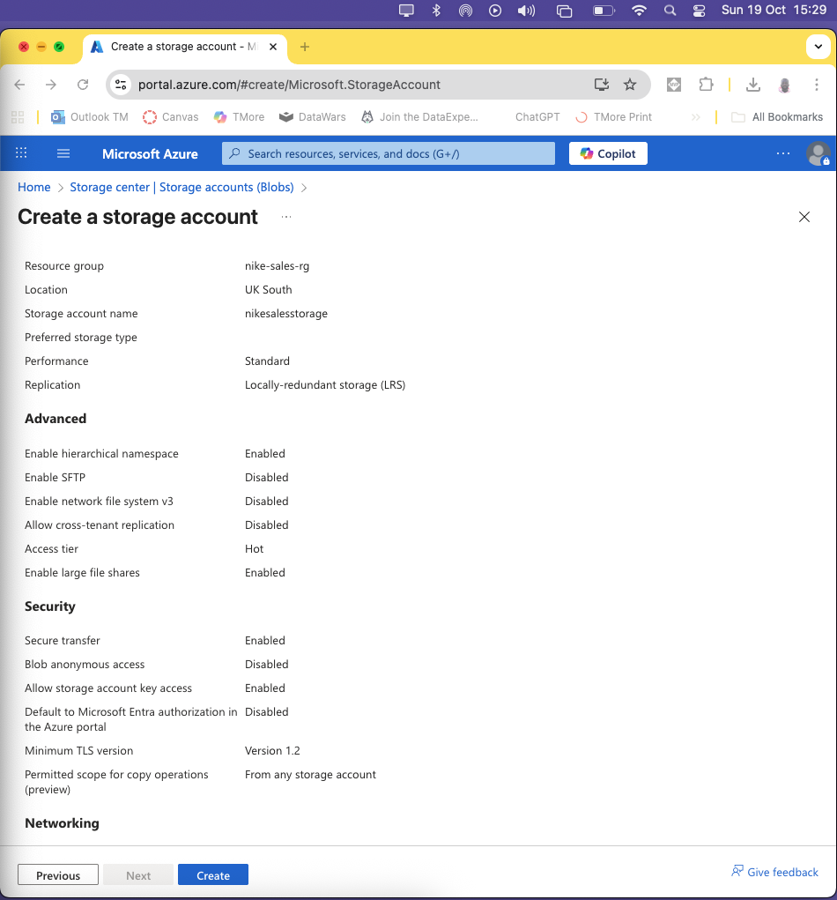
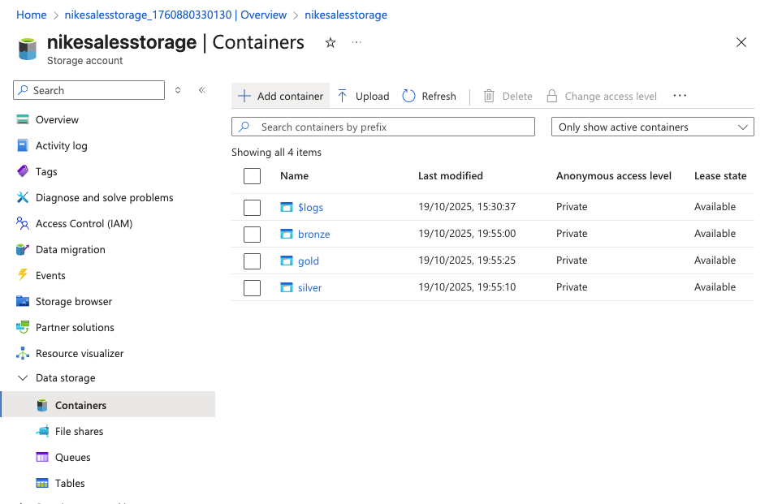
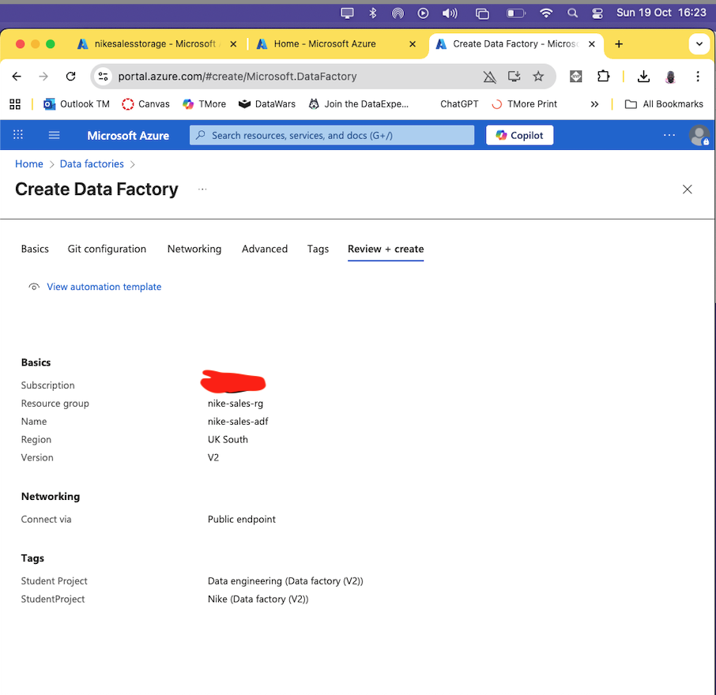
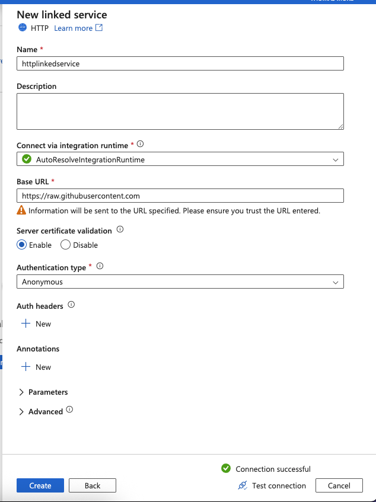
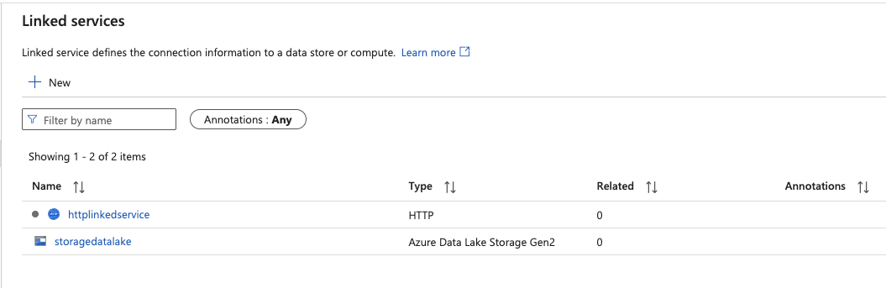
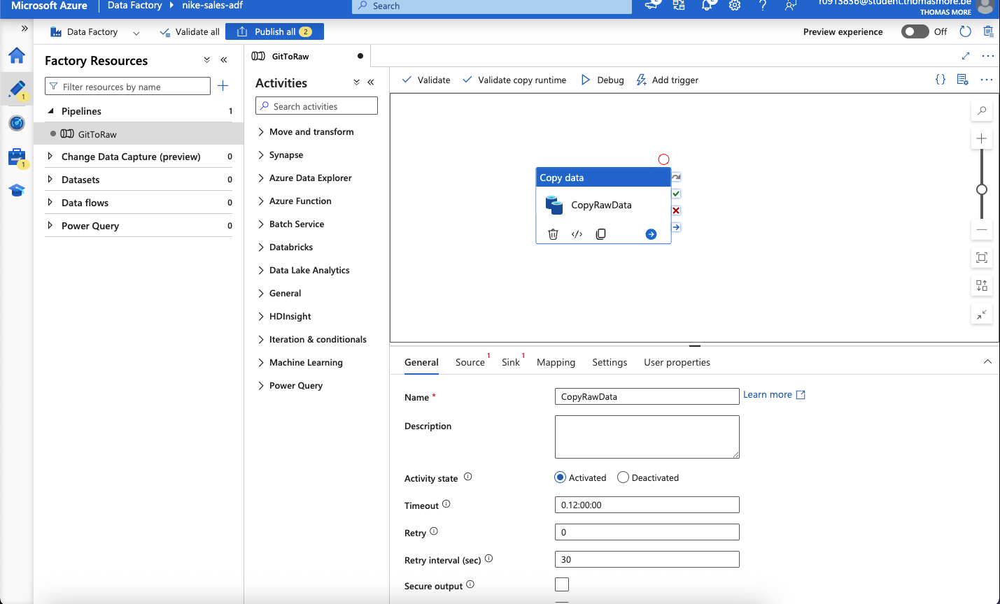
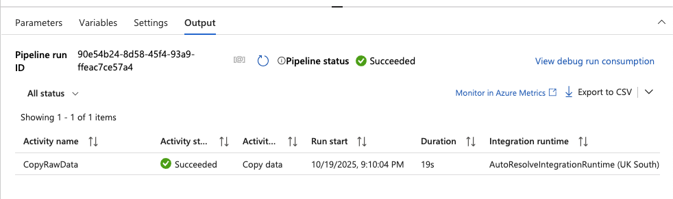

# 🏷️ Nike Sales Intelligence Dashboard: Azure Edition

[](https://www.python.org/)
[](https://azure.microsoft.com/)
[](https://powerbi.microsoft.com/)
[](LICENSE)
[]()
[]()


## 📊 From Raw Data to Smart Decisions

---

### 🔍 Overview

This project transforms messy, real-world Nike retail sales data into actionable business insights using **Azure cloud services**. It demonstrates how Nike’s Supply Chain Intelligence team can leverage cloud-scale analytics to optimize product flow, balance speed and cost, and improve profitability.

---

### 🎯 Goals
- Build a **clean, reliable data pipeline** using Azure.
- Perform **exploratory and predictive analysis** on sales data.
- Deliver **interactive Power BI dashboards** for decision-makers.
- Explore **ML models** for profit prediction and sales segmentation.

---

### 🧱 Architecture
**Azure Services Used:**
- **Azure Data Factory** – Data ingestion
- **Azure Data Lake Storage Gen2** – Raw and cleaned data storage
- **Azure Databricks** – Data cleaning, EDA, ML modeling
- **Azure SQL / Synapse Analytics** – Structured querying
- **Azure Machine Learning** – Optional ML deployment
- **Power BI** – Visualization
- **GitHub** – Version control and collaboration

---

### 📁 Repository Structure

```
nike-sales-intelligence-azure/
├── README.md
├── LICENSE
├── .gitignore
├── requirements.txt
├── azure-pipeline.yml
│
├── data/
│   ├── raw/
│   ├── cleaned/
│   └── sample/
│
├── notebooks/
│   ├── 01_data_cleaning.ipynb
│   ├── 02_eda.ipynb
│   ├── 03_ml_profit_prediction.ipynb
│   ├── 04_ml_segmentation.ipynb
│   ├── 05_anomaly_detection.ipynb
│   └── 06_forecasting.ipynb
│
├── scripts/
│   ├── ingest_data.py
│   ├── clean_data.py
│   ├── ml_models.py
│   └── utils.py
│
├── dashboard/
│   ├── dashboard.pbix
│   ├── screenshots/
│   └── dashboard_notes.md
│
├── docs/
│   ├── architecture.md
│   ├── insights_report.md
│   ├── timeline.md
│   └── demo_script.md
│
└── azure/
    ├── setup_instructions.md
    ├── bicep_templates/
    └── terraform/
```

---

### 📌 Key Features
- **Cloud-scale data pipeline** from ingestion to visualization
- **ML models** for profit prediction and segmentation
- **Interactive dashboards** with filters and KPIs
- **Real-time updates** via Azure SQL/Synapse integration

---

### 🏃 Running Notebooks Locally

1. **Clone the repository:**
```bash
git clone https://github.com/yourusername/nike-sales-intelligence-azure.git
cd nike-sales-intelligence-azure
```

2. **Create a virtual environment:**
```bash
python -m venv venv
source venv/bin/activate      # Linux/Mac
venv\Scripts\activate         # Windows
```

3. **Install dependencies:**
```bash
pip install -r requirements.txt
```

4. **Launch Jupyter Notebook:**
```bash
jupyter notebook
```

5. Open the notebooks in the `notebooks/` folder and run cells sequentially.

> ⚠️ **Note:** Some notebooks require access to Azure services (Data Lake, Databricks, SQL). You can mock data in `data/sample/` for local testing.


---

### 📈 Expected Outcomes
- Insights on top products, regions, and discount strategies
- ML-driven profit predictions and segmentation
- Strategic recommendations for Nike’s sales and supply chain teams


---

### 🏗️ Build Log (Phase 1 – Manual Setup)


#### ✅ Step 1: Create Storage Account
Provisioned `nike-sales-rg` as a **Resource Group** for assets.

#### ✅ Step 2: Create Storage Account
Provisioned `nikesalesstorage` as a **Data Lake Storage Gen2** for raw and cleaned data.

📸 *Screenshot:*  



#### ✅ Step 3: Create Medallion Architecture
Set up `nikesalesstorage` (V2) for stages in transformation.

📸 *Screenshot:*  



#### ✅ Step 4: Create Azure Data Factory
Set up `nike-sales-adf` (V2) for ingestion pipelines.

📸 *Screenshot:*  


> 🧠 *Goal:* Demonstrate manual setup before introducing Infrastructure as Code (IaC) and CI/CD pipelines in Phase 2.

#### ✅ Step 5: Create a pipeline
Set up link services for Github & to Gen 2 Data Storage - bronze


📸 *Screenshot:*  



📸 *Screenshot:*  



Phase 1 – Raw Data Ingestion

   [GitHub]
     │
     ▼
 ┌───────────────┐
 │ Azure Data    │
 │ Factory (ADF) │
 │ Pipeline:     │
 │ GitToRaw      │
 └───────────────┘
     │
     ▼
 ┌───────────────┐
 │ Azure Data    │
 │ Lake Storage  │
 │ Gen2 - Bronze │
 │ (Raw Data)    │
 └───────────────┘


#### ✅ Step 6: Debug & Validate
Run Copy data activitiy from Github to Gen 2 Data Storage - bronze

📸 *Screenshot:*  


📸 *Screenshot:*  



### 🧭 Roadmap

| Phase | Focus | Status |
|-------|-------|--------|
| **0** | Setup |  |
| **1** | Manual Azure Setup |  |
| **2** | Data Pipeline |  |
| **3** | ML & Power BI |  |
| **4** | IaC & CI/CD |  |

Phase 1 Complete
